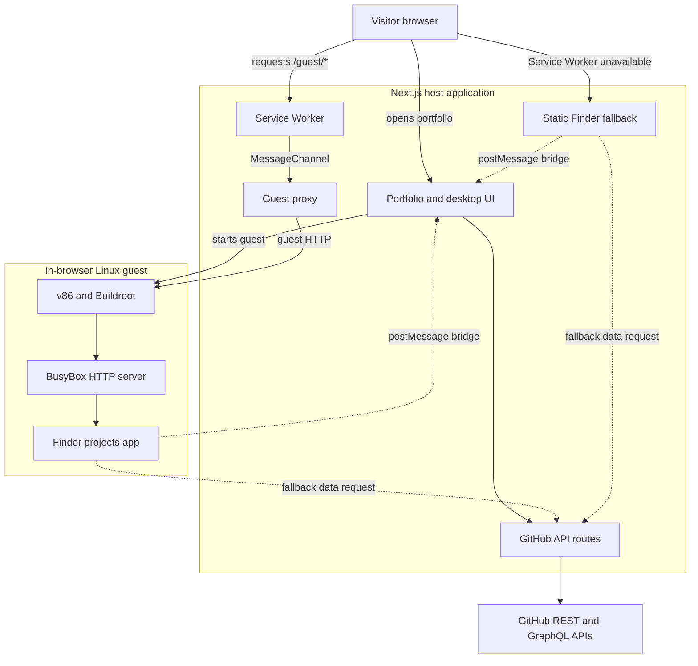

# lam-homepage

A browser-native Matrix workstation where the projects app runs behind a
Buildroot Linux guest. Boot the VM, serve Finder over guest HTTP, bridge live
GitHub data into it, and inspect repositories through a windowed desktop.

<p>
  
  
  
  
</p>

## Architecture



## Highlights

- **Live portfolio data**: loads the configured GitHub profile, repositories,
  pinned projects, stars, and language statistics through server-side API
  routes.
- **Desktop UI**: draggable, resizable, maximizable, minimizable, and
  focusable windows provided by `@lam/desktop`.
- **Repository browser**: browse repository contents, preview Markdown,
  Mermaid diagrams, source code, and images without leaving the page.
- **Browser Linux guest**: v86 boots a Buildroot kernel in the browser. Its
  terminal is rendered with xterm and the guest serves a Finder-style projects
  application through BusyBox HTTP.
- **Browser compatibility fallback**: browsers with Service Worker support use
  the page served by the guest at `/guest/`; browsers without it, including
  some embedded WebViews, use the identical static Finder build at
  `/guest-app/index.html` instead of receiving a 404.
- **Mobile layout**: mobile windows use solid surfaces for readability; the
  Finder's file grid remains touch-scrollable inside the projects window.

## Requirements

- Node.js 22
- pnpm 10.12.4 (declared in `package.json`)
- Internet access when simulator assets are generated for the first time

The simulator asset script uses `dpkg-deb` where available and falls back to
`bsdtar` or `7z` when extracting BusyBox.

## Quick Start

```bash
# Install workspace dependencies from the repository root.
pnpm install

# Download/copy the browser Linux runtime assets once for local simulator use.
pnpm sim:assets

# Start the Next.js app.
pnpm dev
# http://localhost:3000
```

`pnpm dev` rebuilds the static Finder guest application. `pnpm sim:assets` is
only needed manually for a fresh local checkout; production `pnpm build` runs
the asset and Finder preparation steps automatically.

### Optional GitHub Token

Create `apps/web/.env.local` with a least-privilege token that can read the
public profile data you intend to display:

```dotenv
GITHUB_TOKEN=github_token_here
```

The token is read only on the server by API routes. Do not use a token with
unnecessary private-repository access and never expose it through a
`NEXT_PUBLIC_` variable.

Without a token, the site uses GitHub's public API with lower rate limits and
falls back to public profile HTML for pinned repositories.

## Commands

| Command | Description |
| --- | --- |
| `pnpm dev` | Build the guest Finder and run the web app in development mode. |
| `pnpm build` | Build all workspace packages and the production Next.js application. |
| `pnpm start` | Serve the production Next.js build. |
| `pnpm test` | Run all workspace tests. |
| `pnpm typecheck` | Run TypeScript checks across the workspace. |
| `pnpm build:guest` | Build and copy the static Finder application to `apps/web/public/guest-app`. |
| `pnpm sim:assets` | Synchronize v86, firmware, Buildroot, and BusyBox assets to `apps/web/public/sim`. |

## Customization

- Change the displayed GitHub account by updating `username` in
  `apps/web/app/api/github/route.ts`.
- Adjust the Matrix color tokens in `apps/web/app/globals.css`.
- The generated guest Finder is built from `packages/finder/`; run
  `pnpm build:guest` after editing it outside the normal development workflow.

`@lam/desktop`, `@lam/finder`, `@lam/sim-bridge`, and `@lam/sim-vm` are pnpm
workspace packages. Generated simulator assets and the static Finder fallback
are intentionally ignored by Git and created by the documented build commands.

## How the Linux Guest Works

1. `@lam/sim-vm` loads v86, firmware, and a Buildroot kernel from `/sim`.
2. The host creates an in-browser virtual network and provisions the guest with
   BusyBox plus the built Finder files through a 9p filesystem share.
3. BusyBox serves the Finder application on guest port 80.
4. On browsers with Service Worker support, `/guest/*` is proxied to that guest
   HTTP server through a `MessageChannel` owned by the host page.
5. The Finder asks the host for portfolio data through `@lam/sim-bridge`; it
   falls back to the same-origin `/api/github` route when necessary.

The simulator is reachable at `/sim`. The home page starts it in the background
so that the `./projects` window can open when the guest is ready.

## API

| Route | Description |
| --- | --- |
| `GET /api/github` | Returns the configured user's profile, sorted repositories, pinned projects, and aggregate statistics. |
| `GET /api/github/:owner/:repo/contents?path=` | Returns a directory listing or a previewable file. Files over 1 MB and binary files are not returned as text. |
| `GET /api/github/:owner/:repo/contents?path=&raw=1` | Redirects to GitHub's raw download URL when one is available. |

The contents route is designed for the repository browser. Keep the configured
GitHub token least-privileged, as described above.

## Vercel Deployment

This is a pnpm monorepo. Configure Vercel in the project dashboard as follows:

1. Set **Root Directory** to `apps/web`.
2. Select **Node.js 22.x**.
3. Set **Build Command** to `pnpm build`. The web package `prebuild` step builds
   the Finder application and synchronizes simulator assets before `next build`.
4. Add `GITHUB_TOKEN` only if you need higher GitHub API limits. Use a
   least-privilege token with no unnecessary private-repository access.

The build downloads simulator dependencies when they are absent, so the build
environment must have outbound network access. Deployments are triggered by the
Vercel project configuration; this repository does not include a committed
Vercel project configuration.

## Security

See [SECURITY.md](SECURITY.md) for supported versions and instructions for
privately reporting vulnerabilities. Do not submit security issues as public
GitHub issues.

## License

[MIT](LICENSE)
